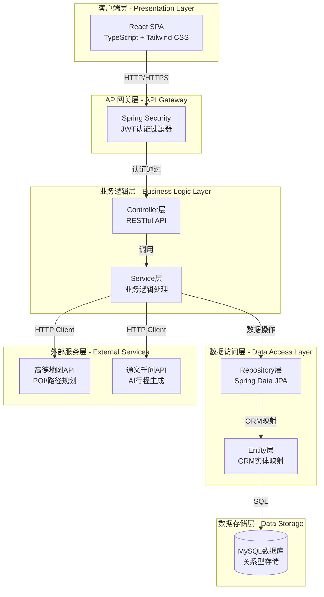
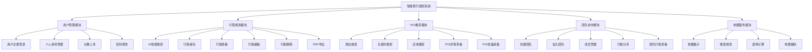
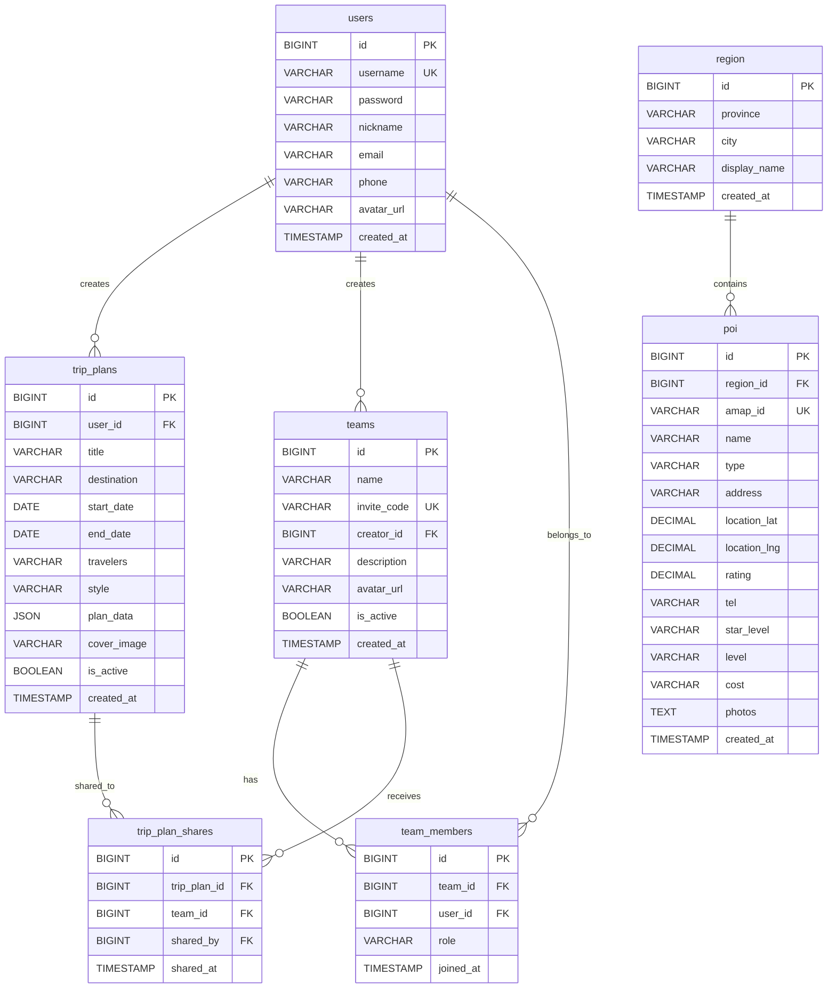
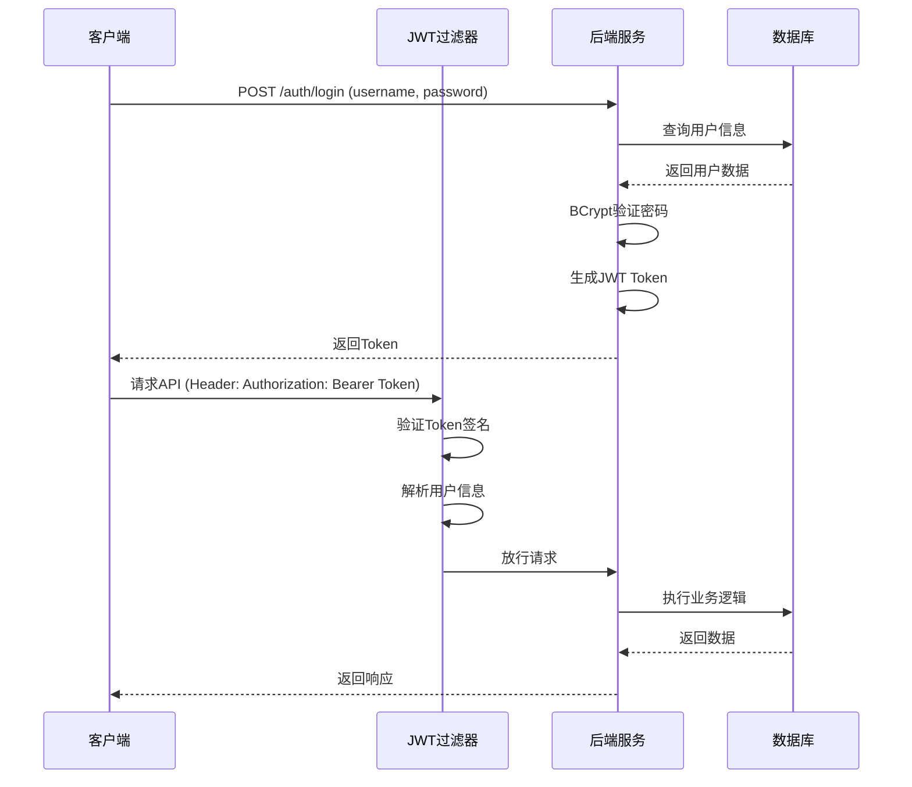
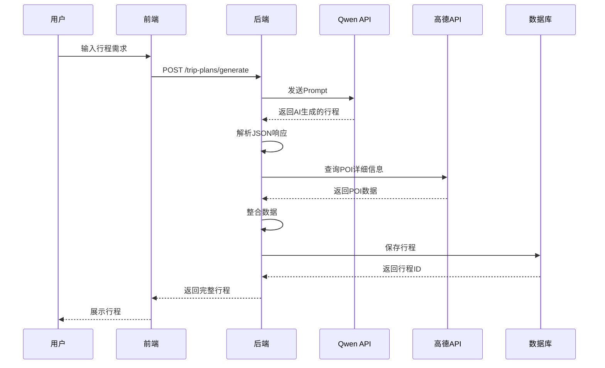
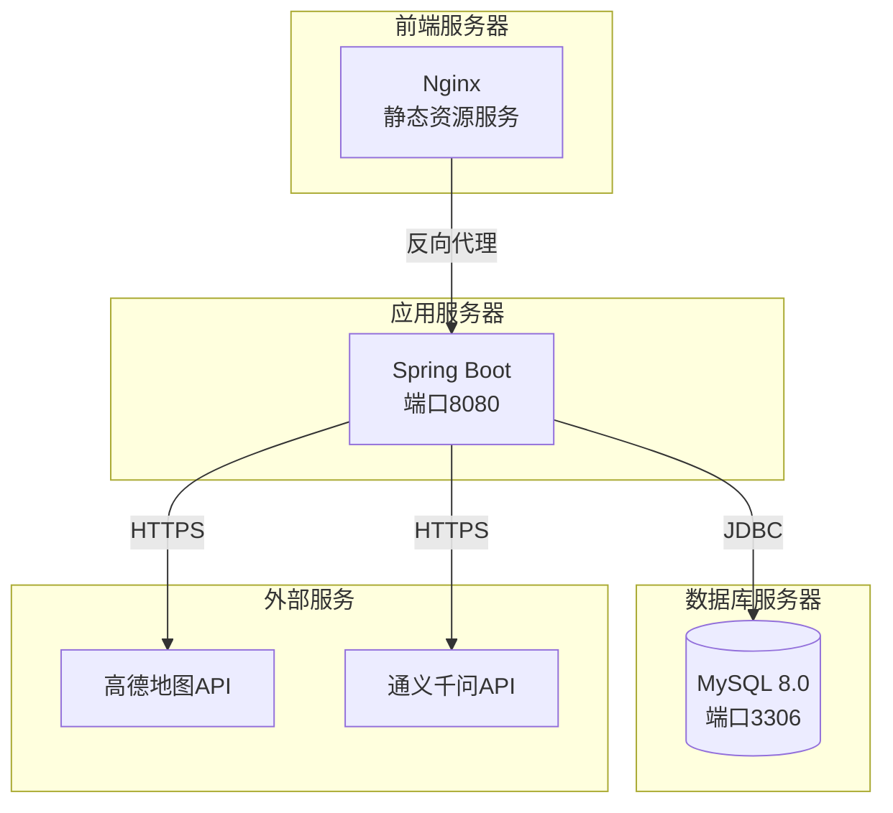

# 智能旅行规划系统技术总结报告

## 摘要

本报告针对基于AI的智能旅行规划系统（Voyager）进行全面的技术总结，涵盖系统架构设计、技术栈选型、数据库设计等核心内容。该系统采用前后端分离架构，集成高德地图API和通义千问大模型，实现了智能行程规划、POI推荐、团队协作等功能。

---

## 一、技术栈总结

### 1.1 后端技术栈

#### 1.1.1 核心框架
- **Spring Boot 3.5.12**: 企业级Java应用开发框架，提供自动配置、依赖注入等特性
- **Spring Data JPA**: 数据持久化框架，简化数据库操作
- **Spring Security**: 安全框架，实现认证授权机制
- **Spring WebFlux**: 响应式Web框架，用于异步HTTP客户端调用

#### 1.1.2 数据库技术
- **MySQL 8.0+**: 关系型数据库管理系统
- **Hibernate**: JPA实现，提供ORM映射功能

#### 1.1.3 安全认证
- **JWT (JSON Web Token)**: 无状态身份认证
  - jjwt-api 0.11.5
  - jjwt-impl 0.11.5
  - jjwt-jackson 0.11.5

#### 1.1.4 工具库
- **Lombok 1.18.44**: 简化Java代码，自动生成getter/setter等方法
- **Jackson**: JSON序列化/反序列化
- **Maven**: 项目构建和依赖管理工具

#### 1.1.5 外部服务集成
- **高德地图API**: 提供POI搜索、地理编码、路径规划等服务
- **通义千问API (Qwen)**: 阿里云大语言模型，用于智能行程生成

### 1.2 前端技术栈

#### 1.2.1 核心框架
- **React 19.0.0**: 用户界面构建库
- **TypeScript 5.8.2**: JavaScript超集，提供类型安全
- **Vite 6.2.0**: 现代化前端构建工具

#### 1.2.2 UI框架与组件
- **Tailwind CSS 4.1.14**: 原子化CSS框架
- **Lucide React 0.546.0**: 图标库
- **Motion 12.23.24**: 动画库

#### 1.2.3 路由与状态管理
- **React Router DOM 7.13.2**: 前端路由管理
- **React Context API**: 全局状态管理

#### 1.2.4 功能库
- **html2canvas 1.4.1**: HTML转Canvas，用于截图
- **jsPDF 4.2.1**: PDF生成库
- **react-markdown 10.1.0**: Markdown渲染

### 1.3 开发工具

#### 1.3.1 IDE与编辑器
- IntelliJ IDEA / VS Code
- Maven Compiler Plugin

#### 1.3.2 版本控制
- Git

#### 1.3.3 API测试工具
- Postman / cURL
- HTTP Client (IntelliJ IDEA)

### 1.4 开发环境

#### 1.4.1 运行环境
- **JDK**: 17
- **Node.js**: 18+
- **MySQL**: 8.0+

#### 1.4.2 服务器配置
- **后端端口**: 8080
- **前端端口**: 3000/5173
- **Context Path**: /api

---

## 二、系统概要设计

### 2.1 系统整体架构设计

本系统采用**前后端分离的B/S架构**，基于RESTful API进行通信。

#### 2.1.1 架构模式
- **表现层**: React单页应用(SPA)
- **业务逻辑层**: Spring Boot后端服务
- **数据访问层**: Spring Data JPA + MySQL
- **外部服务层**: 高德地图API、通义千问API

#### 2.1.2 系统框架图



#### 2.1.3 各层技术与作用

| 层次 | 技术栈 | 主要作用 |
|------|--------|----------|
| **客户端层** | React + TypeScript + Tailwind CSS | 用户界面渲染、交互逻辑、状态管理 |
| **API网关层** | Spring Security + JWT | 身份认证、权限控制、请求过滤 |
| **控制器层** | Spring MVC + @RestController | 接收HTTP请求、参数验证、响应封装 |
| **业务逻辑层** | Spring Service + @Transactional | 业务规则实现、事务管理、异常处理 |
| **数据访问层** | Spring Data JPA + Repository | 数据CRUD操作、查询封装、缓存管理 |
| **实体层** | JPA Entity + Lombok | 数据模型定义、ORM映射、关系维护 |
| **数据存储层** | MySQL 8.0 | 持久化存储、事务支持、索引优化 |
| **外部服务层** | WebClient + RestTemplate | 第三方API调用、响应解析、错误处理 |


### 2.2 体系结构设计

#### 2.2.1 系统功能结构图



#### 2.2.2 核心功能模块说明

##### 2.2.2.1 用户管理模块
**功能描述**: 负责用户身份认证、个人信息管理等基础功能。

**核心组件**:
- `AuthController`: 处理注册、登录请求
- `UserProfileController`: 处理个人资料操作
- `UserService`: 用户业务逻辑
- `JwtUtil`: JWT令牌生成与验证
- `JwtAuthenticationFilter`: 请求拦截与认证

**技术特点**:
- 基于JWT的无状态认证机制
- BCrypt密码加密
- 文件上传支持（头像）

##### 2.2.2.2 行程规划模块
**功能描述**: 核心业务模块，实现AI驱动的智能行程生成与管理。

**核心组件**:
- `TripPlanController`: 行程CRUD接口
- `TripPlanService`: 行程业务逻辑
- `QwenService`: AI行程生成服务
- `TripPlan` Entity: 行程数据模型

**技术特点**:
- 集成通义千问大模型
- JSON格式存储完整行程数据
- 支持行程分享到团队
- PDF导出功能

**数据流程**:
```
用户输入 → 调用Qwen API → 解析AI响应 → 
整合POI数据 → 保存到数据库 → 返回前端展示
```

##### 2.2.2.3 POI推荐模块
**功能描述**: 提供多维度的POI（兴趣点）搜索与推荐服务。

**核心组件**:
- `AmapController`: 高德API代理接口
- `RegionPoiController`: 区域POI查询接口
- `FujianPoiCollectorService`: POI批量采集服务
- `AmapService`: 高德API调用封装

**功能特点**:
- **周边搜索**: 基于地理位置的实时搜索
- **关键词搜索**: 支持模糊匹配
- **区域推荐**: 预先采集的精选POI
- **批量采集**: 后台异步采集任务

**搜索模式对比**:

| 特性 | 周边搜索 | 区域推荐 |
|------|----------|----------|
| 数据来源 | 实时API调用 | 数据库缓存 |
| 响应速度 | 500ms+ | <50ms |
| API消耗 | 每次查询 | 0次 |
| 数据新鲜度 | 实时 | 定期更新 |
| 适用场景 | 动态搜索 | 热门推荐 |

##### 2.2.2.4 团队协作模块
**功能描述**: 支持多人协作的团队管理与行程分享功能。

**核心组件**:
- `TeamController`: 团队管理接口
- `TeamService`: 团队业务逻辑
- `Team`, `TeamMember` Entity: 团队数据模型
- `TripPlanShare` Entity: 行程分享关联

**功能特点**:
- 邀请码机制（4位数字）
- 角色权限管理（创建者/管理员/成员）
- 行程分享与查看
- 成员管理

##### 2.2.2.5 地图服务模块
**功能描述**: 封装高德地图API，提供地图展示、路径规划等服务。

**核心组件**:
- `AmapService`: 统一的地图服务接口
- `InteractiveRouteMap`: 交互式地图组件
- `StaticRouteMap`: 静态地图组件

**提供服务**:
- POI搜索（文本搜索、周边搜索）
- 路径规划（驾车、步行）
- 距离计算（Haversine公式）
- 地理编码（坐标转地址）
- 静态地图生成

---

## 三、数据设计

### 3.1 数据库架构设计

#### 3.1.1 数据库ER图



#### 3.1.2 数据库设计说明

**设计原则**:
1. **规范化设计**: 遵循第三范式，减少数据冗余
2. **外键约束**: 保证数据完整性和引用完整性
3. **索引优化**: 为高频查询字段建立索引
4. **软删除**: 使用is_active标记而非物理删除
5. **时间戳**: 记录创建和更新时间，便于审计

**表关系说明**:
- **一对多关系**: 用户-行程、用户-团队、区域-POI
- **多对多关系**: 用户-团队（通过team_members）、行程-团队（通过trip_plan_shares）
- **级联删除**: 删除用户时级联删除其创建的行程和团队成员关系


### 3.2 数据表结构设计

#### 3.2.1 用户表 (users)

**表说明**: 存储系统用户的基本信息和认证凭据。

| 序号 | 字段名称 | 字段说明 | 字段类型及长度 | 字段约束 |
|------|----------|----------|----------------|----------|
| 1 | id | 用户唯一标识 | BIGINT | PRIMARY KEY, AUTO_INCREMENT |
| 2 | username | 用户名（登录账号） | VARCHAR(50) | NOT NULL, UNIQUE |
| 3 | password | 加密后的密码 | VARCHAR(255) | NOT NULL |
| 4 | nickname | 用户昵称 | VARCHAR(100) | NULL |
| 5 | email | 电子邮箱 | VARCHAR(100) | NULL, INDEX |
| 6 | phone | 手机号码 | VARCHAR(20) | NULL, INDEX |
| 7 | avatar_url | 头像URL | VARCHAR(500) | NULL |
| 8 | created_at | 创建时间 | TIMESTAMP | DEFAULT CURRENT_TIMESTAMP |
| 9 | updated_at | 更新时间 | TIMESTAMP | DEFAULT CURRENT_TIMESTAMP ON UPDATE CURRENT_TIMESTAMP |

**索引设计**:
- PRIMARY KEY: id
- UNIQUE KEY: username
- INDEX: email, phone

**安全设计**:
- 密码使用BCrypt加密存储
- 用户名唯一性约束防止重复注册

---

#### 3.2.2 旅行计划表 (trip_plans)

**表说明**: 存储用户创建的旅行计划，包含完整的行程数据。

| 序号 | 字段名称 | 字段说明 | 字段类型及长度 | 字段约束 |
|------|----------|----------|----------------|----------|
| 1 | id | 行程唯一标识 | BIGINT | PRIMARY KEY, AUTO_INCREMENT |
| 2 | user_id | 创建者ID | BIGINT | NOT NULL, FOREIGN KEY → users(id), INDEX |
| 3 | title | 行程标题 | VARCHAR(200) | NULL |
| 4 | destination | 目的地城市 | VARCHAR(100) | NULL, INDEX |
| 5 | start_date | 开始日期 | DATE | NULL, INDEX |
| 6 | end_date | 结束日期 | DATE | NULL |
| 7 | travelers | 旅行人数 | VARCHAR(50) | NULL |
| 8 | style | 旅行风格 | VARCHAR(50) | NULL |
| 9 | plan_data | 完整行程数据 | JSON | NOT NULL |
| 10 | cover_image | 封面图片URL | VARCHAR(500) | NULL |
| 11 | is_active | 是否有效（软删除） | BOOLEAN | DEFAULT TRUE |
| 12 | created_at | 创建时间 | TIMESTAMP | DEFAULT CURRENT_TIMESTAMP, INDEX |
| 13 | updated_at | 更新时间 | TIMESTAMP | DEFAULT CURRENT_TIMESTAMP ON UPDATE CURRENT_TIMESTAMP |

**索引设计**:
- PRIMARY KEY: id
- FOREIGN KEY: user_id → users(id) ON DELETE CASCADE
- INDEX: user_id, destination, start_date, created_at

**JSON字段结构** (plan_data):
```json
{
  "title": "行程标题",
  "destination": "目的地",
  "localTips": {
    "culture": "文化提示",
    "food": "美食推荐",
    "tips": "旅行建议"
  },
  "days": [
    {
      "day": 1,
      "date": "2024-03-20",
      "weather": {
        "temperature": "18",
        "condition": "晴朗",
        "feelsLike": "20"
      },
      "plans": [
        {
          "time": "09:00",
          "type": "attraction",
          "id": "POI_ID",
          "name": "景点名称",
          "desc": "描述",
          "duration": "2小时",
          "image": "图片URL",
          "rating": 4.8,
          "address": "地址",
          "location": {"lat": 34.99, "lng": 135.78}
        }
      ]
    }
  ]
}
```

---

#### 3.2.3 团队表 (teams)

**表说明**: 存储团队信息，支持多人协作功能。

| 序号 | 字段名称 | 字段说明 | 字段类型及长度 | 字段约束 |
|------|----------|----------|----------------|----------|
| 1 | id | 团队唯一标识 | BIGINT | PRIMARY KEY, AUTO_INCREMENT |
| 2 | name | 团队名称 | VARCHAR(100) | NOT NULL |
| 3 | invite_code | 邀请码（4位数字） | VARCHAR(4) | NOT NULL, UNIQUE, INDEX |
| 4 | creator_id | 创建者ID | BIGINT | NOT NULL, FOREIGN KEY → users(id), INDEX |
| 5 | description | 团队描述 | VARCHAR(500) | NULL |
| 6 | avatar_url | 团队头像URL | VARCHAR(500) | NULL |
| 7 | is_active | 是否激活 | BOOLEAN | DEFAULT TRUE |
| 8 | created_at | 创建时间 | TIMESTAMP | DEFAULT CURRENT_TIMESTAMP, INDEX |
| 9 | updated_at | 更新时间 | TIMESTAMP | DEFAULT CURRENT_TIMESTAMP ON UPDATE CURRENT_TIMESTAMP |

**索引设计**:
- PRIMARY KEY: id
- UNIQUE KEY: invite_code
- FOREIGN KEY: creator_id → users(id) ON DELETE CASCADE
- INDEX: creator_id, invite_code, created_at

**业务规则**:
- 邀请码自动生成，4位数字，全局唯一
- 创建者自动成为团队成员（role='creator'）

---

#### 3.2.4 团队成员表 (team_members)

**表说明**: 存储团队与用户的多对多关系，记录成员角色。

| 序号 | 字段名称 | 字段说明 | 字段类型及长度 | 字段约束 |
|------|----------|----------|----------------|----------|
| 1 | id | 记录唯一标识 | BIGINT | PRIMARY KEY, AUTO_INCREMENT |
| 2 | team_id | 团队ID | BIGINT | NOT NULL, FOREIGN KEY → teams(id), INDEX |
| 3 | user_id | 用户ID | BIGINT | NOT NULL, FOREIGN KEY → users(id), INDEX |
| 4 | role | 角色 | VARCHAR(20) | DEFAULT 'member' |
| 5 | joined_at | 加入时间 | TIMESTAMP | DEFAULT CURRENT_TIMESTAMP |

**索引设计**:
- PRIMARY KEY: id
- UNIQUE KEY: (team_id, user_id) - 同一用户在同一团队中唯一
- FOREIGN KEY: team_id → teams(id) ON DELETE CASCADE
- FOREIGN KEY: user_id → users(id) ON DELETE CASCADE
- INDEX: team_id, user_id

**角色类型**:
- `creator`: 创建者（拥有所有权限）
- `admin`: 管理员（可管理成员）
- `member`: 普通成员（可查看分享的行程）

---

#### 3.2.5 行程分享表 (trip_plan_shares)

**表说明**: 存储行程与团队的分享关系，实现行程共享功能。

| 序号 | 字段名称 | 字段说明 | 字段类型及长度 | 字段约束 |
|------|----------|----------|----------------|----------|
| 1 | id | 分享记录唯一标识 | BIGINT | PRIMARY KEY, AUTO_INCREMENT |
| 2 | trip_plan_id | 行程ID | BIGINT | NOT NULL, FOREIGN KEY → trip_plans(id) |
| 3 | team_id | 团队ID | BIGINT | NOT NULL, FOREIGN KEY → teams(id), INDEX |
| 4 | shared_by | 分享者ID | BIGINT | NOT NULL, FOREIGN KEY → users(id), INDEX |
| 5 | shared_at | 分享时间 | TIMESTAMP | DEFAULT CURRENT_TIMESTAMP, INDEX |

**索引设计**:
- PRIMARY KEY: id
- UNIQUE KEY: (trip_plan_id, team_id) - 同一行程不能重复分享给同一团队
- FOREIGN KEY: trip_plan_id → trip_plans(id) ON DELETE CASCADE
- FOREIGN KEY: team_id → teams(id) ON DELETE CASCADE
- FOREIGN KEY: shared_by → users(id) ON DELETE CASCADE
- INDEX: team_id, shared_by, shared_at

**业务规则**:
- 只有行程创建者可以分享行程
- 同一行程可以分享给多个团队
- 团队成员可以查看分享给该团队的所有行程

---

#### 3.2.6 省市表 (region)

**表说明**: 存储省份和城市的层级关系，支持区域POI推荐。

| 序号 | 字段名称 | 字段说明 | 字段类型及长度 | 字段约束 |
|------|----------|----------|----------------|----------|
| 1 | id | 区域唯一标识 | BIGINT | PRIMARY KEY, AUTO_INCREMENT |
| 2 | province | 省份名称 | VARCHAR(50) | NOT NULL, INDEX |
| 3 | city | 城市名称 | VARCHAR(50) | NULL（NULL表示省级数据） |
| 4 | display_name | 显示名称 | VARCHAR(100) | NOT NULL |
| 5 | created_at | 创建时间 | TIMESTAMP | DEFAULT CURRENT_TIMESTAMP |
| 6 | updated_at | 更新时间 | TIMESTAMP | DEFAULT CURRENT_TIMESTAMP ON UPDATE CURRENT_TIMESTAMP |

**索引设计**:
- PRIMARY KEY: id
- UNIQUE KEY: (province, city) - 省份+城市组合唯一
- INDEX: province

**数据层级**:
- 省级数据: province='福建省', city=NULL
- 市级数据: province='福建省', city='福州市'

---

#### 3.2.7 POI推荐表 (poi)

**表说明**: 存储预先采集的POI（兴趣点）数据，提供离线推荐服务。

| 序号 | 字段名称 | 字段说明 | 字段类型及长度 | 字段约束 |
|------|----------|----------|----------------|----------|
| 1 | id | POI唯一标识 | BIGINT | PRIMARY KEY, AUTO_INCREMENT |
| 2 | region_id | 关联的区域ID | BIGINT | NOT NULL, FOREIGN KEY → region(id), INDEX |
| 3 | amap_id | 高德POI ID | VARCHAR(100) | NOT NULL |
| 4 | name | POI名称 | VARCHAR(200) | NOT NULL, INDEX |
| 5 | type | POI类型 | VARCHAR(50) | NOT NULL, INDEX |
| 6 | address | 地址 | VARCHAR(500) | NULL |
| 7 | location_lat | 纬度 | DECIMAL(10, 7) | NOT NULL, INDEX |
| 8 | location_lng | 经度 | DECIMAL(10, 7) | NOT NULL, INDEX |
| 9 | rating | 评分 | DECIMAL(3, 1) | NULL |
| 10 | tel | 电话 | VARCHAR(50) | NULL |
| 11 | star_level | 酒店星级 | VARCHAR(20) | NULL |
| 12 | level | 景点等级 | VARCHAR(20) | NULL |
| 13 | cost | 人均消费 | VARCHAR(20) | NULL |
| 14 | photos | 图片URL列表 | TEXT | NULL（逗号分隔） |
| 15 | amap_type | 高德POI类型 | VARCHAR(100) | NULL |
| 16 | created_at | 创建时间 | TIMESTAMP | DEFAULT CURRENT_TIMESTAMP |
| 17 | updated_at | 更新时间 | TIMESTAMP | DEFAULT CURRENT_TIMESTAMP ON UPDATE CURRENT_TIMESTAMP |

**索引设计**:
- PRIMARY KEY: id
- UNIQUE KEY: (region_id, amap_id) - 同一区域内高德ID唯一
- FOREIGN KEY: region_id → region(id) ON DELETE CASCADE
- INDEX: (region_id, type), (name, location_lat, location_lng)

**POI类型枚举**:
- `hotel`: 酒店
- `attraction`: 景点
- `restaurant`: 餐厅

**数据来源**:
- 通过FujianPoiCollectorService批量采集
- 调用高德地图API获取
- 经过去重、过滤、排序后存储

---

### 3.3 数据库关系说明

#### 3.3.1 实体关系矩阵

| 关系类型 | 主实体 | 从实体 | 关系描述 | 实现方式 |
|----------|--------|--------|----------|----------|
| 一对多 | users | trip_plans | 一个用户可创建多个行程 | user_id外键 |
| 一对多 | users | teams | 一个用户可创建多个团队 | creator_id外键 |
| 多对多 | users | teams | 一个用户可加入多个团队 | team_members中间表 |
| 多对多 | trip_plans | teams | 一个行程可分享给多个团队 | trip_plan_shares中间表 |
| 一对多 | region | poi | 一个区域包含多个POI | region_id外键 |

#### 3.3.2 级联操作规则

| 操作 | 主表 | 从表 | 级联规则 | 业务含义 |
|------|------|------|----------|----------|
| DELETE | users | trip_plans | CASCADE | 删除用户时删除其所有行程 |
| DELETE | users | teams | CASCADE | 删除用户时删除其创建的团队 |
| DELETE | users | team_members | CASCADE | 删除用户时删除其团队成员关系 |
| DELETE | teams | team_members | CASCADE | 删除团队时删除所有成员关系 |
| DELETE | teams | trip_plan_shares | CASCADE | 删除团队时删除所有分享关系 |
| DELETE | trip_plans | trip_plan_shares | CASCADE | 删除行程时删除所有分享关系 |
| DELETE | region | poi | CASCADE | 删除区域时删除所有POI |


### 3.4 数据库性能优化设计

#### 3.4.1 索引策略

**主键索引**:
- 所有表均使用BIGINT类型的自增主键
- 保证查询性能和数据唯一性

**唯一索引**:
- users.username: 防止用户名重复
- teams.invite_code: 保证邀请码全局唯一
- (team_id, user_id): 防止重复加入团队
- (trip_plan_id, team_id): 防止重复分享
- (region_id, amap_id): 防止POI重复采集

**普通索引**:
- 外键字段: 提升JOIN查询性能
- 时间字段: 支持按时间排序和筛选
- 地理坐标: 支持空间查询（可扩展为空间索引）

#### 3.4.2 查询优化

**分页查询**:
```sql
-- 使用LIMIT和OFFSET实现分页
SELECT * FROM trip_plans 
WHERE user_id = ? AND is_active = TRUE
ORDER BY created_at DESC
LIMIT 10 OFFSET 0;
```

**复合查询优化**:
```sql
-- 使用索引覆盖扫描
SELECT id, title, destination, created_at
FROM trip_plans
WHERE user_id = ? AND is_active = TRUE
ORDER BY created_at DESC;
```

**JOIN优化**:
```sql
-- 使用INNER JOIN减少数据量
SELECT tp.*, u.username
FROM trip_plans tp
INNER JOIN users u ON tp.user_id = u.id
WHERE tp.is_active = TRUE;
```

#### 3.4.3 数据存储优化

**JSON字段使用**:
- plan_data使用JSON类型存储复杂结构
- 减少表关联，提升查询性能
- 支持JSON路径查询（MySQL 5.7+）

**TEXT字段优化**:
- photos字段使用TEXT类型
- 存储逗号分隔的URL列表
- 避免创建额外的图片表

**软删除设计**:
- 使用is_active标记代替物理删除
- 保留历史数据，支持数据恢复
- 查询时需添加is_active条件

---

## 四、系统安全设计

### 4.1 认证与授权

#### 4.1.1 JWT认证机制

**认证流程**:


**Token结构**:
```json
{
  "header": {
    "alg": "HS256",
    "typ": "JWT"
  },
  "payload": {
    "sub": "username",
    "iat": 1234567890,
    "exp": 1234654290
  },
  "signature": "..."
}
```

**安全特性**:
- Token有效期: 24小时
- 密钥长度: 256位
- 算法: HMAC-SHA256
- 无状态设计，服务端不存储Token

#### 4.1.2 密码安全

**加密算法**: BCrypt
- 自动加盐
- 计算成本可配置
- 抗彩虹表攻击

**密码策略**:
- 最小长度: 6位（建议8位以上）
- 存储格式: BCrypt哈希值
- 传输加密: HTTPS

### 4.2 API安全

#### 4.2.1 CORS配置

**允许的源**:
- http://localhost:3000
- http://localhost:5173

**允许的方法**:
- GET, POST, PUT, DELETE, OPTIONS

**允许的头**:
- Authorization
- Content-Type
- 自定义头

#### 4.2.2 接口权限控制

**公开接口** (无需认证):
- /auth/** - 认证相关
- /amap/** - 地图服务代理
- /pics/** - 静态资源
- /fujian-poi/** - POI采集管理
- /region-poi/** - 区域POI查询

**受保护接口** (需要JWT):
- /profile/** - 个人资料
- /trip-plans/** - 行程管理
- /teams/** - 团队管理
- /upload/** - 文件上传

---

## 五、系统特色功能

### 5.1 AI智能行程规划

#### 5.1.1 技术实现

**集成方案**: 通义千问大模型 (Qwen3-32B)

**调用流程**:


**Prompt工程**:
- 结构化输出要求
- JSON格式约束
- 上下文信息注入
- 示例引导

**数据整合**:
- AI生成行程框架
- 高德API补充POI详情
- 天气信息模拟
- 本地化建议生成

#### 5.1.2 功能特点

**智能化**:
- 根据旅行风格定制行程
- 考虑景点开放时间
- 优化路线规划
- 提供本地化建议

**个性化**:
- 支持多种旅行风格（文化、美食、休闲等）
- 可指定旅行人数
- 灵活的天数选择
- 自定义目的地

### 5.2 POI批量采集系统

#### 5.2.1 采集架构

**系统设计**:


**采集策略**:
- 每个城市采集3种类型（酒店、景点、餐厅）
- 每种类型调用2页API（每页25条）
- 经过过滤和排序后保留6个高质量POI
- API调用间隔200ms，避免限流

**数据质量控制**:
1. **去重**: 基于高德ID和名称+坐标
2. **过滤**: 排除停车场、入口等子POI
3. **排序**: 按评分、图片、电话等维度
4. **验证**: 坐标范围验证

#### 5.2.2 性能优势

| 指标 | 实时搜索 | 批量采集 | 提升比例 |
|------|----------|----------|----------|
| 响应时间 | 500ms+ | <50ms | 10倍+ |
| API调用 | 每次查询 | 0次 | 100% |
| 数据稳定性 | 波动 | 稳定 | - |
| 离线可用 | 否 | 是 | - |

### 5.3 团队协作功能

#### 5.3.1 功能设计

**邀请机制**:
- 4位数字邀请码
- 全局唯一性保证
- 简单易记

**权限管理**:
- 创建者: 完全控制权
- 管理员: 成员管理权
- 成员: 查看权限

**行程分享**:
- 一对多分享（一个行程分享给多个团队）
- 实时同步
- 权限隔离

#### 5.3.2 数据隔离

**查询策略**:
```sql
-- 用户可见的行程 = 自己创建的 + 团队分享的
SELECT DISTINCT tp.*
FROM trip_plans tp
LEFT JOIN trip_plan_shares tps ON tp.id = tps.trip_plan_id
LEFT JOIN team_members tm ON tps.team_id = tm.team_id
WHERE (tp.user_id = ? OR tm.user_id = ?)
  AND tp.is_active = TRUE;
```

**权限验证**:
- 行程操作: 验证user_id
- 团队操作: 验证role
- 分享操作: 验证创建者身份

---

## 六、系统部署与运维

### 6.1 部署架构

**推荐部署方案**:


### 6.2 环境配置

**生产环境配置** (application-prod.yml):
```yaml
server:
  port: 8080
  servlet:
    context-path: /api

spring:
  datasource:
    url: jdbc:mysql://localhost:3306/tripagent?useSSL=true
    username: ${DB_USERNAME}
    password: ${DB_PASSWORD}
  
  jpa:
    hibernate:
      ddl-auto: validate  # 生产环境使用validate
    show-sql: false       # 关闭SQL日志

jwt:
  secret: ${JWT_SECRET}   # 使用环境变量
  expiration: 86400000

logging:
  level:
    root: INFO
    com.example.voyagerdemo: INFO
```

### 6.3 性能监控

**关键指标**:
- API响应时间
- 数据库连接池状态
- JVM内存使用
- 外部API调用成功率

**日志管理**:
- 应用日志: SLF4J + Logback
- 访问日志: Nginx access.log
- 错误日志: 独立文件存储

---

## 七、总结与展望

### 7.1 系统特点总结

**技术创新**:
1. 集成大语言模型实现智能行程规划
2. POI批量采集提升系统性能
3. 前后端分离架构保证可扩展性
4. JWT无状态认证提升安全性

**功能完整性**:
1. 用户管理: 注册、登录、资料管理
2. 行程规划: AI生成、保存、编辑、分享
3. POI推荐: 实时搜索、区域推荐
4. 团队协作: 创建团队、成员管理、行程共享
5. 地图服务: 路径规划、距离计算

**性能优势**:
1. 响应速度: 区域推荐<50ms
2. API节省: 批量采集减少实时调用
3. 数据稳定: 离线POI数据不受API波动影响

### 7.2 技术亮点

**后端架构**:
- Spring Boot 3.x最新特性
- JPA + Hibernate ORM映射
- Spring Security安全框架
- WebFlux响应式编程

**前端技术**:
- React 19最新版本
- TypeScript类型安全
- Tailwind CSS原子化设计
- Vite高性能构建

**数据设计**:
- 规范化数据库设计
- JSON字段存储复杂结构
- 索引优化查询性能
- 软删除保留历史数据

### 7.3 未来展望

**功能扩展**:
1. 支持更多省份的POI采集
2. 实时协作编辑行程
3. 社交分享功能
4. 行程评价与推荐系统

**技术优化**:
1. 引入Redis缓存
2. 实现分布式部署
3. 添加消息队列
4. 微服务架构改造

**性能提升**:
1. 数据库读写分离
2. CDN加速静态资源
3. API响应缓存
4. 数据库分库分表

---

## 附录

### A. 技术栈版本清单

| 类别 | 技术 | 版本 |
|------|------|------|
| 后端框架 | Spring Boot | 3.5.12 |
| Java版本 | JDK | 17 |
| 数据库 | MySQL | 8.0+ |
| ORM框架 | Hibernate | 6.x |
| 安全框架 | Spring Security | 6.x |
| JWT库 | jjwt | 0.11.5 |
| 前端框架 | React | 19.0.0 |
| 类型系统 | TypeScript | 5.8.2 |
| 构建工具 | Vite | 6.2.0 |
| UI框架 | Tailwind CSS | 4.1.14 |
| 图标库 | Lucide React | 0.546.0 |
| 路由 | React Router | 7.13.2 |

### B. API接口清单

**认证接口**:
- POST /api/auth/register - 用户注册
- POST /api/auth/login - 用户登录

**用户接口**:
- GET /api/profile - 获取个人资料
- PUT /api/profile - 更新个人资料
- PUT /api/profile/password - 修改密码
- POST /api/upload/avatar - 上传头像

**行程接口**:
- POST /api/trip-plans/generate - AI生成行程
- GET /api/trip-plans/my - 查询我的行程
- GET /api/trip-plans/visible - 查询可见行程
- GET /api/trip-plans/{id} - 查询行程详情
- DELETE /api/trip-plans/{id} - 删除行程
- POST /api/trip-plans/{id}/share - 分享行程
- DELETE /api/trip-plans/{id}/share/{teamId} - 取消分享

**团队接口**:
- POST /api/teams - 创建团队
- GET /api/teams - 获取团队列表
- GET /api/teams/{id} - 获取团队详情
- PUT /api/teams/{id} - 更新团队信息
- DELETE /api/teams/{id} - 删除团队
- POST /api/teams/{id}/members - 添加成员
- DELETE /api/teams/{id}/members/{userId} - 删除成员
- POST /api/teams/join/{inviteCode} - 加入团队

**POI接口**:
- GET /api/amap/search-suggestions - 搜索建议
- GET /api/amap/search-all - 综合搜索
- GET /api/amap/nearby-all - 周边搜索
- GET /api/region-poi/provinces - 获取省份列表
- GET /api/region-poi/cities - 获取城市列表
- GET /api/region-poi/pois - 获取城市POI

**采集接口**:
- POST /api/fujian-poi/init-regions - 初始化城市
- POST /api/fujian-poi/collect-all - 采集所有城市
- POST /api/fujian-poi/collect-city - 采集指定城市
- GET /api/fujian-poi/status - 查询采集状态
- GET /api/fujian-poi/statistics - 查询统计信息
- DELETE /api/fujian-poi/clear - 清空数据

### C. 数据库脚本

**初始化脚本**:
- database/region_poi_tables.sql - 区域POI表
- database/team_tables.sql - 团队表
- database/trip_plan_tables.sql - 行程表

**索引优化脚本**:
```sql
-- 用户表索引
CREATE INDEX idx_users_email ON users(email);
CREATE INDEX idx_users_phone ON users(phone);

-- 行程表索引
CREATE INDEX idx_trip_plans_user_id ON trip_plans(user_id);
CREATE INDEX idx_trip_plans_destination ON trip_plans(destination);
CREATE INDEX idx_trip_plans_created_at ON trip_plans(created_at);

-- POI表索引
CREATE INDEX idx_poi_region_type ON poi(region_id, type);
CREATE INDEX idx_poi_location ON poi(location_lat, location_lng);
```

---

**报告编制日期**: 2026年3月30日  
**系统版本**: v1.0.0  
**文档版本**: v1.0

